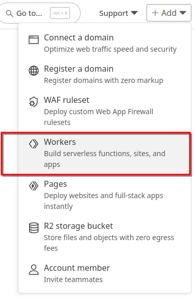
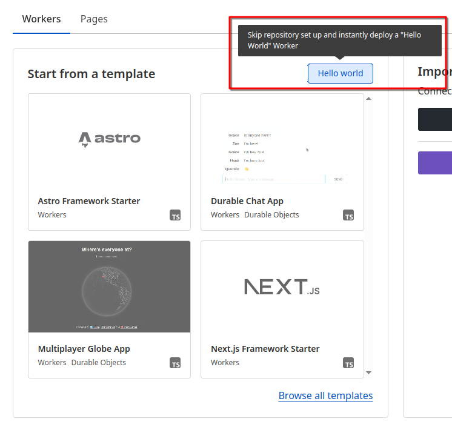
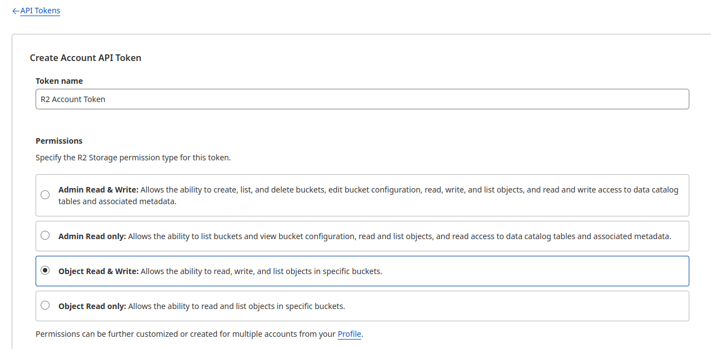
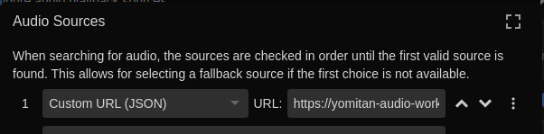

# Cloudflare Worker Yomitan Audio Source

**!! Japanese Only !!**

**No commits does not mean not maintained. If there's a problem, create an issue!**

This is a self deployable Cloudflare Worker that serves as an audio source for Yomitan. Hosting it for yourself falls completely within the free limits of Cloudflare Workers. As an audio source it can be used from any device without having to run a local server or install an Anki-Addon or have any local storage used up. [^1]

Additionally it has extra features like pitch accent aware TTS and boasts the largest collection of Japanese audio available. Read more here: <https://animecards.site/yomitan_audio/>

## Too lazy to setup?

If you want a no-hassle setup consider signing up for the $1 tier on the Patreon: <https://www.patreon.com/quizmaster/membership>. It saves you the trouble of setting up a Cloudflare and AWS account to enjoy all features. 🙂

## Setup

### Requirements

1. Ensure `npm` and `rclone` are installed on your system.

### Cloudflare

1. Create a Cloudflare account → https://dash.cloudflare.com/sign-up

2. Create a worker and select the "Hello World" template.

    

    

3. Name your worker `yomitan-audio-worker` and deploy it.

    

4. Go to `R2 Project Storage` in the left sidebar and create a new bucket named `yomitan-audio-bucket`.

5. Go to `Storage & Database` → `D1 SQL Database` and create a new database called `yomitan-audio-db`.

### Locally

1. Clone the repository and run the following commands:

    - `npm install` to install the dependencies.
    - `npx wrangler login` to authenticate with your Cloudflare account.

2. Copy `wrangler.toml.example` to `wrangler.toml` and replace the `database_id` entry with the ID of your previously created R2 bucket. Also adjust:

    - `AUTHENTICATION_ENABLED` if you want the endpoints to be protected by a password **(STRONGLY RECOMMENDED)**.
    - `AWS_POLLY_ENABLED` if you want the pitch acccent TTS, as well as the AWS credentials with Polly access.

    If you change these also run `npx wrangler types` to update the types.

3. Copy `.dev.vars.example` to `.dev.vars` and replace the following:

    - `API_KEYS` with a comma separated list of API keys that will be used to authenticate requests.
    - AWS credentials with Polly access.

4. Download the audio data and put it into the repository folder. [MORE INFO ON DISCORD](https://animecards.site/discord/). (You should have a bunch of folders ending with `_files` in `data`.)

5. Import the entries and pitch data into your D1 database by running the following command:

    - `npx wrangler d1 execute yomitan-audio-db --remote --file=data/entry_and_pitch_db.sql`

6. Go [here](https://dash.cloudflare.com/?to=/:account/r2/api-tokens) and create an API Token to access your R2 bucket.

    

7. Upload the audio files to your R2 bucket by running the following command, replacing the placeholders with your own values from the previous step:

    - `R2_ACCESS_KEY_ID="your_access_key" R2_SECRET_ACCESS_KEY="your_secret_key" R2_ACCOUNT_ID="your_cloudflare_account_id" bash scripts/upload-to-r2.sh`

8. Upload the variables in `.dev.vars` to Cloudflare by running the following command:

    - `npx wrangler secret put API_KEYS`
    - `npx wrangler secret put AWS_ACCESS_KEY_ID`
    - `npx wrangler secret put AWS_SECRET_ACCESS_KEY`

9. Deploy the worker by running the following command:

    - `npx wrangler deploy`

### Yomitan

1. Go to the Yomitan settings and set the `Audio Source URL` to your worker URL and `audio/list?term={term}&reading={reading}&apiKey=yourApiKey` so for example `https://yomitan-audio-worker.friedrichde.workers.dev/audio/list?term={term}&reading={reading}&apiKey=m9NixGU7qtWv4SYr`

    

Your worker should be up and running now and you getting unlimited Yomitan audio through your worker!

[^1]: Note that you will still need to add a payment method to your Cloudflare account to create some rescoures, but you will not be charged for using this worker for yourself.
